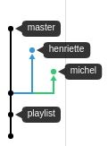
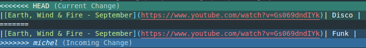
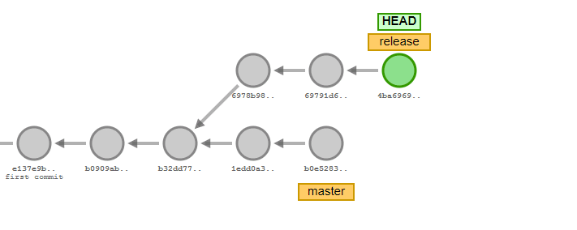
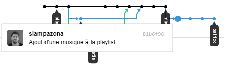
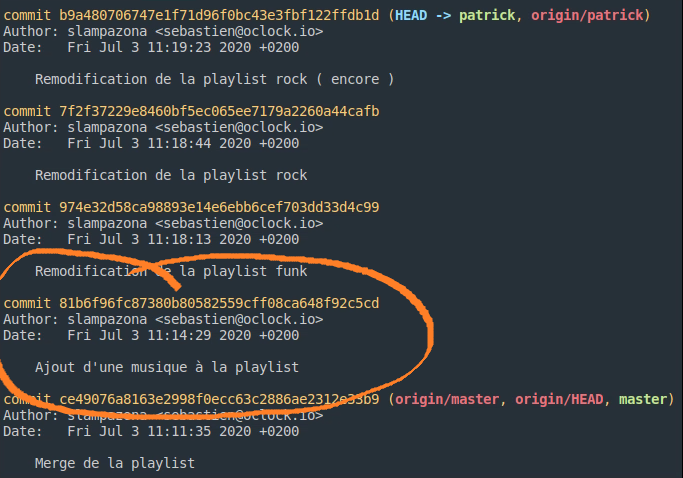

# Exos git.

Pour commencer, regarder la page `Insight > Network` permet de se faire une bonne idée de l'état actuel de l'espace de travail.



## Régler les conflit

### La terre le vent et le feu

Michel et Henriette, les deux DJs officiels de l'école, ont décidé de mettre la playlist à jour, mais chacun de leur côté, histoire d'aller plus vite.

Sauf que le partage des tâches n'a pas été bien fait. Résultat ils se sont tous les 2 attaqués à la playlist Funk...

:memo: TODO
- Commencer par fusionner la branche de Henriette sur master en local.
- Puis fusionner la branche de Michel de la même manière. Il va falloir régler les conflits !


<details>
<summary>Pour fusionner</summary>

:warning: Toujours s'assurer, avec `git status`, d'être placé sur la branche qui "reçoit" le code.

1 solution, 3 syntaxes : 
- La classique : 
  1. Rappatrier la branche distante en local `git fetch origin henriette:henriette`
  2. Récupérer les changements `git pull . henriette`
- La raccourcie :
  1. Récupérer directement les changements depuis la branche distante `git pull origin henriette`
- La raccourcie plus propre :
  1. Rappatrier la branche en local PUIS récupérer les changements `git merge origin/henriette`

</details>
<details>
<summary>Pour régler les conflits</summary>

Si vous avez ce style de message : 

```
Fusion automatique de playlist.md
CONFLIT (contenu) : Conflit de fusion dans playlist.md
La fusion automatique a échoué ; réglez les conflits et validez le résultat.
```

C'est que vous avez un conflit à régler, en gros la branche où vous êtes actuellement et la branche que vous tentez de merger, on fait une modification au même endroit sur le même fichier. Git ne sachant pas laquelle des 2 modification il faut garder, il vous demande donc de choisir.

Si on fait un git status, on a l'inventaire de ce qui a été modifié des 2 cotés

```
Vous avez des chemins non fusionnés.
  (réglez les conflits puis lancez "git commit")
  (utilisez "git merge --abort" pour annuler la fusion)

Chemins non fusionnés :
  (utilisez "git add <fichier>..." pour marquer comme résolu)

        modifié des deux côtés :  playlist.md

aucune modification n'a été ajoutée à la validation (utilisez "git add" ou "git commit -a")
```

Ici on voit `modifié des deux côtés :  playlist.md` , il faut donc aller voir ce fichier et la on s'appercoit de ceci : 



On s'appercoit que la branche précédemment mergée ( celle d'henriette ) avait dit que `Earth, Wind & Fire - September` était du Disco, et on voit que Michel a mis la même chanson mais en disant que c'était du Funk.

Un choix s'offre à nous, sachant que `Earth, Wind & Fire - September` c'est clairement pas du disco, on va garder la version de Michou ! Du coups on modifie le fichier : 

```
<<<<<<< HEAD
|[Earth, Wind & Fire - September](https://www.youtube.com/watch?v=Gs069dndIYk)| Disco |
=======
|[Earth, Wind & Fire - September](https://www.youtube.com/watch?v=Gs069dndIYk)| Funk |
>>>>>>> michel
```
Devient alors :
```
|[Earth, Wind & Fire - September](https://www.youtube.com/watch?v=Gs069dndIYk)| Funk |
```

On supprime les caractères chelou, ainsi que la version qui ne nous intéresse pas.

Puis on fait un `git add .` pour suivre la modification de résolution de conflit, on commit `git commit -m "Merge de michel dans master"` et enfin on peut push si on le veut `git push origin master`

</details>


## Rebase une branche



### Cacher la poussière sous le tapis

1. Crée une nouvelle branche qui s'appelle comme toi (sauf si tu t'appelle Michel, tu peux l'appeler `michel_2`)
2. Ajoute des trucs dans la playlist (pas trop d'un coup, le but c'est de faire pleins de commits !)
3. `git add .`, `git commit -m "message"`, `git push origin <branche>`
4. Repète les points 2 et 3 plusieurs fois.

Si on va voir l'état du "network" sur Github... c'est le bazar !

Dans un gros projet (type `express`), si on proposait une PR comme ça, on prendrait un méchant retour négatif qui nous dirait probablement "Squash your commits!".  

#### Mais ça veut dire quoi ?

Le but d'un "rebase-squash" est de créer un seul commit qui regroupe tout un tas de modifs, donc d'autres commits ! C'est un peu comme ranger des boites dans une boite plus grande.

C'est très pratique pour travailler en "step by step", et pouvoir quand même proposer un seul gros bloc de modifications, ce qui est beaucoup plus facile à _review_.

#### Et on fait comment ?

1. D'abord identifier le commit _qui précède_ notre premier commit de travail. Copier son id.  

Pour le visualiser : 


Pour être sûr : 



2. Taper `git rebase -i id_du_commit_copié`.
   ex : `git rebase -i 81b6f96fc87380b80582559cff08ca648f92c5cd`
3. Dans l'éditeur qui s'ouvre (nano, vm, ...), laisser `pick` pour le premier commit de la liste et remplacer le reste par `squash`. Sauver + quitter  
`<Todo: screenshot + erreurs communes>`
4. Dans le 2ème éditeur, on choisit le commentaire du nouveau "méga-commit". Normalement il est déjà constitué d'un assemblage des commentaires des "petits commits" (pratique !). Sauver + quitter  
5. `git log` pour vérifier. :tada:

#### Et pour push ?

Si on a déjà push les petits commit, et qu'on essaye de push le "gros patapouf tout fusionné", on se retrouve avec une erreur :
```
impossible de pousser des références
[...]
Les mises à jour ont été rejetées car la pointe de la branche courante est derrière son homologue distant.
```

Hé oui, on a rappatrié nos commits "dans le premier", qu'on a fait grossir. Le serveur distant (GitHub) considère donc que des commits ont simplement disparus, et qu'on est dans le passé.

On va donc lui dire qu'on est sur de ce qu'on fait, et que "oui, ces commits ont disparus, t'inquiète pas tout va bien".

:warning: **Avant de continuer, il faut quand même vérifier que tout est OK. C'est le point de non-retour**, le moment ou si on a fait une bétise, on peut perdre du travail...

Pour forcer la mise à jour : `git push --force origin nom_de_la_branche`.

